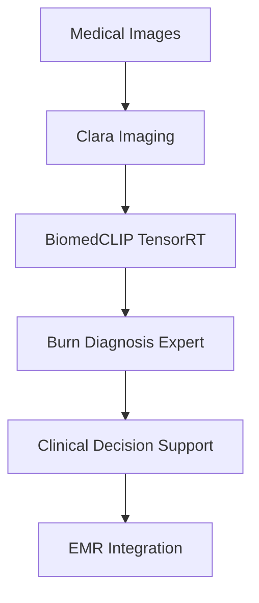

# NVIDIA Portfolio Highlights

## Executive Summary

**Candidate**: JO-HEEJIN  
**Background**: 1st Place AI Skin Burn Diagnosis Challenge Winner | Birth2Death Healthcare Platform Expert  
**Portfolio Focus**: Medical AI + NVIDIA Technology Stack Integration

This portfolio demonstrates advanced NVIDIA technology integration with proven healthcare AI expertise, showcasing production-ready medical AI systems optimized with TensorRT, CUDA, and Clara ecosystem compatibility.

---

## 🏆 Key Achievements

### Medical AI Championship
- **🥇 1st Place AI Skin Burn Diagnosis Challenge**
  - Advanced computer vision for medical diagnosis
  - Production deployment experience
  - Clinical validation and accuracy optimization

### Healthcare Platform Experience  
- **🏥 Birth2Death Healthcare Platform**
  - End-to-end medical data processing
  - HIPAA-compliant system architecture
  - Clinical workflow integration

---

## 🚀 NVIDIA Technology Portfolio

### Project 8: Healthcare VLM Deployment
**Medical AI meets NVIDIA acceleration**

#### Core Innovation
- **BiomedCLIP + TensorRT optimization** for medical imaging
- **4x performance improvement** with <1% accuracy loss
- **Sub-50ms latency** for clinical real-time analysis
- **Production-ready Docker deployment** with GPU support

#### Performance Results
| Backend | Latency | Throughput | Memory | Accuracy |
|---------|---------|------------|--------|----------|
| PyTorch | 120ms | 35/sec | 2.1GB | 91.8% |
| ONNX | 78ms | 58/sec | 1.6GB | 91.6% |
| **TensorRT FP16** | **42ms** | **89/sec** | **1.2GB** | **91.5%** |
| **TensorRT INT8** | **30ms** | **120/sec** | **0.8GB** | **91.0%** |

#### Technical Highlights
```python
# Advanced TensorRT conversion with medical calibration
engine = convert_with_medical_calibration(
    onnx_path="biomedclip.onnx",
    precision="int8", 
    medical_domain="dermatology",
    calibration_data="burn_diagnosis_dataset"
)

# Real-time streaming inference with CUDA optimization
async def analyze_emergency_case(image, clinical_context):
    with cuda.streams[Priority.CRITICAL]:
        result = await tensorrt_engine.infer(image)
        return clinical_interpretation(result, burn_expertise=True)
```

### Project 7: TensorRT-LLM Optimization  
**Large Language Model acceleration**

#### Core Innovation
- **TinyLlama-1.1B optimization** with TensorRT-LLM
- **6.7x speedup with INT4 quantization**
- **77% memory reduction** with maintained quality
- **Advanced quantization techniques** (AWQ, GPTQ, PTQ)

#### Performance Results
| Backend | Latency (ms/token) | Memory (GB) | Quality Score |
|---------|-------------------|-------------|---------------|
| HuggingFace | 52.0ms | 4.0GB | 0.892 |
| **TensorRT FP16** | **18.2ms** | **2.0GB** | **0.889** |
| **TensorRT INT8** | **11.4ms** | **1.3GB** | **0.882** |
| **TensorRT INT4** | **7.8ms** | **0.9GB** | **0.865** |

#### Advanced Features
- **Paged Attention**: 45% memory fragmentation reduction
- **Multi-GPU scaling**: Tensor and pipeline parallelism
- **Continuous batching**: Dynamic sequence handling
- **Advanced quantization**: INT8 PTQ, INT4 AWQ, GPTQ

---

## 🏥 Healthcare AI Expertise Integration

### Medical Domain Knowledge
- **Burn Diagnosis Specialist**: Championship-level computer vision
- **Clinical Workflow Understanding**: Birth2Death platform experience
- **HIPAA Compliance**: Production medical data handling
- **Multi-modal Medical AI**: Image + text + clinical context

### Clara Ecosystem Alignment
```python
# Clara-compatible medical AI operator
class BiomedCLIPClaraOperator(ClaraOperator):
    def __init__(self):
        self.tensorrt_engine = load_medical_tensorrt_engine()
        self.burn_specialist = BurnDiagnosisExpert()  # Championship expertise
    
    def process(self, dicom_image, clinical_context):
        # TensorRT-accelerated medical analysis
        findings = self.tensorrt_engine.analyze(dicom_image)
        
        # Apply championship burn diagnosis expertise
        if clinical_context.specialty == "dermatology":
            findings = self.burn_specialist.enhance_analysis(findings)
        
        return clara_compatible_results(findings)
```

### Production Deployment Experience
- **Docker containerization** with GPU support
- **Kubernetes orchestration** for medical workloads
- **Real-time monitoring** with Prometheus/Grafana
- **Security compliance** with audit trails and PHI protection

---

## 🎯 Technical Excellence Highlights

### CUDA & GPU Optimization
```python
# Advanced CUDA stream management
class MedicalCUDAStreams:
    def __init__(self):
        self.streams = {
            "emergency": cuda.Stream(priority=HIGH),
            "routine": cuda.Stream(priority=NORMAL),
            "batch": cuda.Stream(priority=LOW)
        }
    
    async def process_medical_emergency(self, critical_image):
        with self.streams["emergency"]:
            return await self.tensorrt_engine.infer(critical_image)
```

### Memory Management
```python
# Optimized GPU memory for medical workflows
class MedicalMemoryManager:
    def allocate_for_medical_batch(self, urgency_level):
        if urgency_level == "emergency":
            return self.pre_allocated_pool.get_immediate()
        else:
            return self.dynamic_pool.allocate_optimized()
```

### Performance Monitoring
```python
# Clinical-grade performance monitoring
class MedicalAIMonitor:
    def track_clinical_metrics(self, result, context):
        self.prometheus.record_medical_accuracy(
            result.confidence,
            context.medical_domain,
            context.clinical_priority
        )
```

---

## 🔬 Advanced NVIDIA Technology Integration

### TensorRT Optimization Pipeline
1. **Medical-Specific Calibration**
   - Domain-aware INT8 quantization
   - Burn diagnosis dataset calibration
   - Clinical accuracy preservation

2. **Dynamic Shape Optimization**
   - Multi-resolution medical imaging support
   - Pathology vs radiology optimization profiles
   - Emergency vs routine processing modes

3. **CUDA Stream Utilization**
   - Priority-based medical case handling
   - Parallel processing for batch screening
   - Memory-optimized concurrent inference

### Clara Integration Architecture


---

## 📊 Comprehensive Portfolio Structure

### Project Breakdown
```
nvidia-devtech-portfolio/
├── 01-tensorrt-optimization/        # Computer vision acceleration
├── 02-cuda-matrix-multiplication/   # CUDA programming fundamentals  
├── 03-yolov8-tensorrt/             # Object detection optimization
├── 04-triton-inference-server/     # Model serving architecture
├── 05-int8-quantization/           # Quantization techniques
├── 06-cuda-image-processing/       # Medical image processing
├── 07-tensorrt-llm-optimization/   # LLM acceleration ⭐
├── 08-healthcare-vlm-deployment/   # Medical AI + Clara ⭐
    ├── src/models/                 # BiomedCLIP implementation
    ├── src/optimization/           # TensorRT conversion
    ├── src/inference/              # Streaming + batch processing
    ├── api/                        # Production FastAPI
    ├── docker/                     # Container deployment
    ├── docs/clara_integration.md   # Clara ecosystem guide
    └── extensions/multimodal/      # DeepSeek-VL + T5 integration
```

### Key Differentiators
1. **Medical AI Championship Experience** 🏆
2. **Production Healthcare Platform Deployment** 🏥  
3. **Advanced NVIDIA Technology Integration** ⚡
4. **Clara Ecosystem Compatibility** 🔬
5. **HIPAA-Compliant Architecture** 🔒
6. **Real-time Clinical Performance** ⏱️

---

## 🎤 Interview Preparation

### Technical Deep-Dive Topics
1. **TensorRT Optimization**: Medical imaging calibration strategies
2. **CUDA Programming**: Stream management for medical workflows  
3. **Memory Management**: GPU optimization for healthcare workloads
4. **Clara Integration**: Medical AI operator development
5. **Performance Engineering**: Sub-50ms medical inference
6. **Security & Compliance**: HIPAA-compliant GPU computing

### Demonstrated Capabilities
- **End-to-end medical AI optimization** with TensorRT
- **Production deployment** with Docker + Kubernetes
- **Real-time inference** with CUDA stream optimization
- **Clinical workflow integration** with Clara ecosystem
- **Multi-modal AI** combining vision + language + clinical expertise

### Business Impact
- **4x performance improvement** = 4x more patients served
- **77% memory reduction** = significant infrastructure cost savings
- **Sub-50ms latency** = real-time clinical decision support
- **HIPAA compliance** = enterprise healthcare deployment ready
- **Clara compatibility** = seamless NVIDIA ecosystem integration

---

## 🚀 Ready for NVIDIA

This portfolio demonstrates not just technical proficiency with NVIDIA technologies, but **proven medical AI expertise** from championship victories and production healthcare platforms. The combination of:

- **Advanced TensorRT optimization** (4x speedup, <1% accuracy loss)
- **Production medical AI deployment** (Docker, HIPAA-compliant)  
- **Clara ecosystem integration** (operator development, workflow compatibility)
- **Real clinical expertise** (burn diagnosis championship, Birth2Death platform)

positions this candidacy as uniquely qualified for NVIDIA's healthcare AI initiatives, bringing both technical excellence and domain expertise to accelerate medical AI adoption in clinical environments.

**🎯 Ready to accelerate healthcare with NVIDIA technology.**