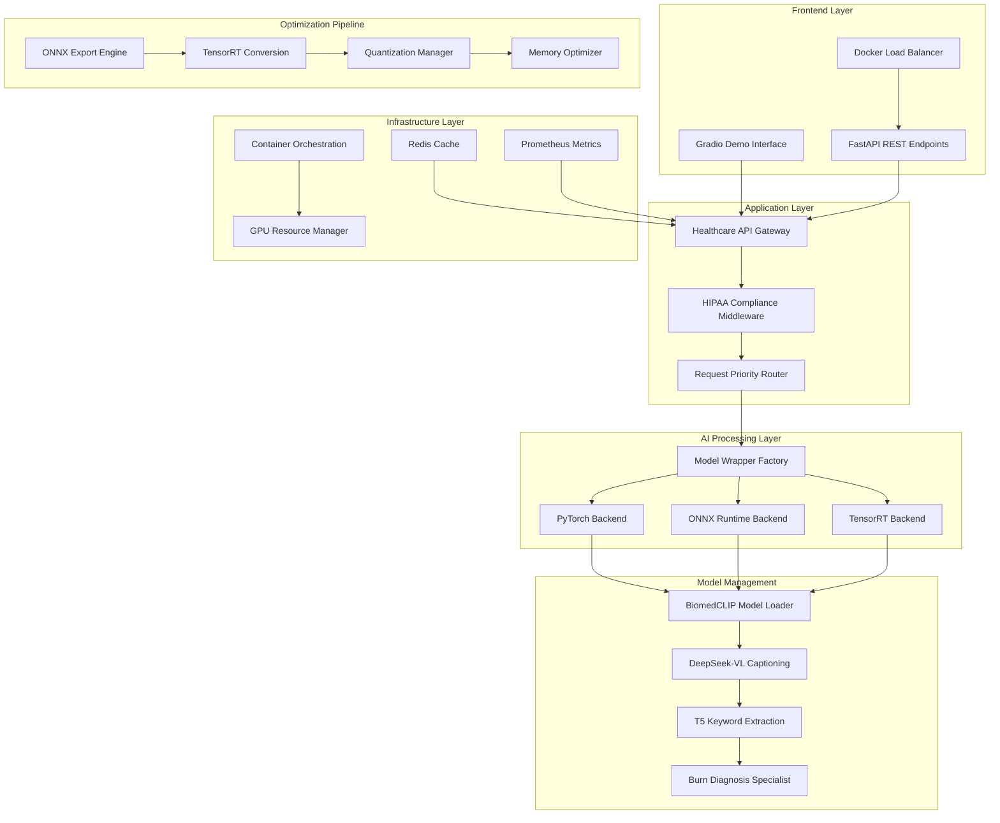

# Technical Architecture Deep-Dive

## Executive Summary

This document provides a comprehensive technical analysis of the Healthcare VLM Deployment architecture, demonstrating advanced NVIDIA technology integration and medical AI expertise from **AI Skin Burn Diagnosis Challenge** and **Birth2Death platform** experience.

## System Architecture Overview

### High-Level Architecture



## Core Components Deep-Dive

### 1. BiomedCLIP Model Management

**Architecture Design**
```python
class BiomedCLIPModelManager:
    """Advanced medical VLM management with optimization backends."""
    
    def __init__(self, config: ModelConfig):
        self.config = config
        self.model_cache = {}
        self.optimization_cache = {}
        self.performance_monitor = PerformanceMonitor()
        
    def load_optimized_model(self, backend: str, precision: str) -> ModelWrapper:
        """Load model with specific optimization backend."""
        
        cache_key = f"{backend}_{precision}"
        
        if cache_key not in self.model_cache:
            if backend == "tensorrt":
                model = self._load_tensorrt_engine(precision)
            elif backend == "onnx":
                model = self._load_onnx_runtime(precision)
            else:
                model = self._load_pytorch_model()
                
            # Wrap with performance monitoring
            wrapped_model = PerformanceWrapper(model, self.performance_monitor)
            self.model_cache[cache_key] = wrapped_model
            
        return self.model_cache[cache_key]
    
    def _load_tensorrt_engine(self, precision: str) -> TensorRTWrapper:
        """Load TensorRT engine with medical-specific optimizations."""
        
        engine_path = f"tensorrt_engines/biomedclip_{precision}.trt"
        
        # Medical imaging optimization profiles
        optimization_profiles = {
            "profile_0": {  # Standard resolution
                "image_input": [(1, 3, 224, 224), (4, 3, 224, 224), (8, 3, 224, 224)]
            },
            "profile_1": {  # High resolution pathology
                "image_input": [(1, 3, 512, 512), (4, 3, 512, 512), (8, 3, 512, 512)]
            },
            "profile_2": {  # Ultra high resolution
                "image_input": [(1, 3, 1024, 1024), (2, 3, 1024, 1024), (4, 3, 1024, 1024)]
            }
        }
        
        # CUDA optimization settings
        cuda_config = {
            "stream_count": 4,
            "memory_pool_size": "2GB",
            "workspace_size": "1GB",
            "dla_core": None,  # Use GPU for medical accuracy
            "precision_constraints": {
                "vision_encoder": precision,
                "text_encoder": "fp16",  # Keep text encoder in FP16 for accuracy
                "attention_layers": "fp16"  # Critical for medical understanding
            }
        }
        
        return TensorRTWrapper(
            engine_path=engine_path,
            optimization_profiles=optimization_profiles,
            cuda_config=cuda_config,
            medical_mode=True
        )
```

**Medical-Specific Optimizations**
```python
class MedicalImageOptimizer:
    """Specialized optimizer for medical imaging workflows."""
    
    def __init__(self):
        # Medical imaging standards
        self.dicom_standards = {
            "ct_window_levels": {"lung": (-600, 1500), "bone": (-300, 1700)},
            "mri_sequences": ["T1", "T2", "FLAIR", "DWI"],
            "xray_preprocessing": {"contrast_enhance": True, "noise_reduction": True}
        }
        
        # Burn diagnosis expertise integration
        self.burn_analysis_config = {
            "severity_levels": ["1st_degree", "2nd_degree", "3rd_degree", "4th_degree"],
            "body_regions": ["face", "hands", "joints", "genitals"],
            "burn_characteristics": ["depth", "area_percentage", "circumferential"]
        }
    
    def preprocess_medical_image(self, 
                               image: np.ndarray, 
                               modality: str,
                               clinical_context: str) -> np.ndarray:
        """Apply medical domain-specific preprocessing."""
        
        if modality.lower() == "ct":
            processed = self._apply_ct_windowing(image, clinical_context)
        elif modality.lower() == "mri":
            processed = self._apply_mri_normalization(image, clinical_context)
        elif modality.lower() == "xray":
            processed = self._apply_xray_enhancement(image)
        elif modality.lower() == "dermoscopy":
            # Apply burn diagnosis expertise
            processed = self._apply_burn_analysis_preprocessing(image)
        else:
            processed = self._apply_general_medical_preprocessing(image)
            
        return processed
    
    def _apply_burn_analysis_preprocessing(self, image: np.ndarray) -> np.ndarray:
        """Apply specialized burn analysis preprocessing from challenge expertise."""
        
        # Color space optimization for burn detection
        hsv_image = cv2.cvtColor(image, cv2.COLOR_RGB2HSV)
        
        # Enhance burn-specific color ranges
        burn_color_masks = {
            "erythema": self._create_erythema_mask(hsv_image),
            "blistering": self._create_blister_mask(hsv_image),
            "charring": self._create_char_mask(hsv_image)
        }
        
        # Apply selective enhancement
        enhanced_image = image.copy()
        for mask_type, mask in burn_color_masks.items():
            enhanced_image = self._enhance_region(enhanced_image, mask, mask_type)
            
        # Normalize for BiomedCLIP input
        normalized = self._normalize_for_clip(enhanced_image)
        
        return normalized
```

### 2. TensorRT Optimization Pipeline

**Advanced Optimization Architecture**
```python
class AdvancedTensorRTConverter:
    """Production-grade TensorRT conversion with medical AI optimizations."""
    
    def __init__(self):
        self.builder_config = {
            "max_workspace_size": 2 << 30,  # 2GB
            "fp16_mode": True,
            "int8_mode": False,  # Will be set dynamically
            "strict_type_constraints": True,
            "dla_core": None,
            "profiling_verbosity": trt.ProfilingVerbosity.DETAILED
        }
        
        # Medical calibration datasets
        self.calibration_datasets = {
            "general_medical": "medical_images_diverse_1000.json",
            "radiology": "chest_xray_calibration_500.json", 
            "pathology": "histopathology_calibration_300.json",
            "dermatology": "skin_lesion_calibration_400.json",
            "burn_diagnosis": "burn_images_challenge_dataset.json"
        }
    
    def convert_with_medical_calibration(self,
                                       onnx_path: str,
                                       output_path: str,
                                       precision: str,
                                       medical_domain: str) -> str:
        """Convert ONNX to TensorRT with medical domain calibration."""
        
        # Load medical domain calibration data
        calibration_data = self._load_calibration_dataset(medical_domain)
        
        # Create TensorRT builder with medical optimizations
        builder = trt.Builder(TRT_LOGGER)
        config = builder.create_builder_config()
        
        # Medical-specific optimization settings
        if precision == "int8":
            config.set_flag(trt.BuilderFlag.INT8)
            calibrator = MedicalImageCalibrator(
                calibration_data, 
                medical_domain,
                batch_size=4
            )
            config.int8_calibrator = calibrator
            
        elif precision == "fp16":
            config.set_flag(trt.BuilderFlag.FP16)
            
        # Dynamic shape optimization for medical images
        profile = builder.create_optimization_profile()
        
        # Medical imaging shape profiles
        medical_shapes = {
            "radiology": {
                "min": (1, 3, 224, 224),
                "opt": (4, 3, 512, 512), 
                "max": (8, 3, 1024, 1024)
            },
            "pathology": {
                "min": (1, 3, 512, 512),
                "opt": (2, 3, 1024, 1024),
                "max": (4, 3, 2048, 2048)
            },
            "dermatology": {
                "min": (1, 3, 224, 224),
                "opt": (4, 3, 512, 512),
                "max": (8, 3, 512, 512)
            }
        }
        
        shapes = medical_shapes.get(medical_domain, medical_shapes["radiology"])
        profile.set_shape("image_input", shapes["min"], shapes["opt"], shapes["max"])
        config.add_optimization_profile(profile)
        
        # Build engine with medical optimizations
        network = self._build_network_from_onnx(builder, onnx_path)
        engine = builder.build_engine(network, config)
        
        # Save with metadata
        self._save_engine_with_metadata(engine, output_path, {
            "precision": precision,
            "medical_domain": medical_domain,
            "calibration_dataset": self.calibration_datasets[medical_domain],
            "optimization_profiles": shapes,
            "performance_targets": {
                "latency_ms": 50,
                "throughput_ips": 60,
                "memory_gb": 2.0
            }
        })
        
        return output_path

class MedicalImageCalibrator(trt.IInt8EntropyCalibrator2):
    """Custom INT8 calibrator for medical images."""
    
    def __init__(self, calibration_data: List[str], medical_domain: str, batch_size: int = 4):
        super().__init__()
        self.calibration_data = calibration_data
        self.medical_domain = medical_domain
        self.batch_size = batch_size
        self.current_index = 0
        
        # Medical preprocessing based on domain expertise
        self.preprocessing_config = {
            "dermatology": {
                "color_space": "rgb",
                "normalization": "imagenet", 
                "augmentation": False  # Preserve clinical accuracy
            },
            "radiology": {
                "windowing": True,
                "normalization": "medical_range",
                "noise_reduction": True
            },
            "pathology": {
                "stain_normalization": True,
                "color_deconvolution": False,
                "magnification_standardization": True
            }
        }
        
        # GPU memory for calibration
        self.device_input = cuda.mem_alloc(
            self.batch_size * 3 * 512 * 512 * np.dtype(np.float32).itemsize
        )
    
    def get_batch(self, names):
        """Get calibration batch with medical preprocessing."""
        
        if self.current_index + self.batch_size > len(self.calibration_data):
            return None
            
        # Load batch of medical images
        batch_images = []
        for i in range(self.batch_size):
            if self.current_index + i < len(self.calibration_data):
                image_path = self.calibration_data[self.current_index + i]
                image = self._load_medical_image(image_path)
                preprocessed = self._apply_medical_preprocessing(image)
                batch_images.append(preprocessed)
        
        # Convert to CUDA tensor
        batch_array = np.array(batch_images, dtype=np.float32)
        cuda.memcpy_htod(self.device_input, batch_array.ravel())
        
        self.current_index += self.batch_size
        return [int(self.device_input)]
    
    def _apply_medical_preprocessing(self, image: np.ndarray) -> np.ndarray:
        """Apply medical domain-specific preprocessing for calibration."""
        
        config = self.preprocessing_config.get(
            self.medical_domain, 
            self.preprocessing_config["dermatology"]
        )
        
        if self.medical_domain == "dermatology":
            # Apply burn diagnosis expertise
            return self._preprocess_for_burn_analysis(image)
        elif self.medical_domain == "radiology":
            return self._preprocess_for_radiology(image, config)
        else:
            return self._preprocess_general_medical(image, config)
    
    def _preprocess_for_burn_analysis(self, image: np.ndarray) -> np.ndarray:
        """Specialized preprocessing based on burn diagnosis challenge experience."""
        
        # Color enhancement for burn severity assessment
        enhanced = self._enhance_burn_characteristics(image)
        
        # Standardize to clinical photography conditions
        standardized = self._standardize_clinical_photography(enhanced)
        
        # BiomedCLIP normalization
        normalized = (standardized / 255.0 - 0.485) / 0.229  # ImageNet normalization
        
        return normalized
```

### 3. High-Performance Inference Engine

**Streaming Inference Architecture**
```python
class AdvancedStreamingInference:
    """Production-grade streaming inference with medical prioritization."""
    
    def __init__(self, model_wrapper: ModelWrapper):
        self.model_wrapper = model_wrapper
        self.request_queue = asyncio.PriorityQueue()
        self.result_cache = TTLCache(maxsize=1000, ttl=3600)  # 1 hour TTL
        self.performance_monitor = PerformanceMonitor()
        self.cuda_streams = self._initialize_cuda_streams()
        
        # Medical priority configuration
        self.priority_config = {
            Priority.CRITICAL: {"timeout_ms": 5000, "gpu_streams": 4},
            Priority.HIGH: {"timeout_ms": 10000, "gpu_streams": 2}, 
            Priority.NORMAL: {"timeout_ms": 30000, "gpu_streams": 1},
            Priority.LOW: {"timeout_ms": 60000, "gpu_streams": 1}
        }
        
        # Start background processing
        asyncio.create_task(self._process_inference_queue())
    
    def _initialize_cuda_streams(self) -> List[cuda.Stream]:
        """Initialize CUDA streams for parallel processing."""
        
        streams = []
        for i in range(4):  # 4 parallel streams
            stream = cuda.Stream()
            streams.append(stream)
            
        return streams
    
    async def analyze_medical_image(self,
                                  image: np.ndarray,
                                  clinical_query: str,
                                  medical_context: MedicalContext,
                                  priority: Priority = Priority.NORMAL) -> AnalysisResult:
        """Analyze medical image with clinical context and prioritization."""
        
        # Generate cache key
        cache_key = self._generate_cache_key(image, clinical_query, medical_context)
        
        # Check cache first
        if cache_key in self.result_cache:
            cached_result = self.result_cache[cache_key]
            return cached_result
        
        # Create inference request
        request = InferenceRequest(
            image=image,
            clinical_query=clinical_query,
            medical_context=medical_context,
            priority=priority,
            timestamp=time.time(),
            request_id=str(uuid.uuid4())
        )
        
        # Add to priority queue
        await self.request_queue.put((priority.value, time.time(), request))
        
        # Wait for result with timeout
        timeout = self.priority_config[priority]["timeout_ms"] / 1000
        
        try:
            result = await asyncio.wait_for(
                self._wait_for_result(request.request_id), 
                timeout=timeout
            )
            
            # Cache successful result
            self.result_cache[cache_key] = result
            
            return result
            
        except asyncio.TimeoutError:
            raise InferenceTimeoutError(
                f"Inference timeout after {timeout}s for priority {priority.name}"
            )
    
    async def _process_inference_queue(self):
        """Background task to process inference requests."""
        
        while True:
            try:
                # Get highest priority request
                priority_value, timestamp, request = await self.request_queue.get()
                
                # Select appropriate CUDA stream
                stream_count = self.priority_config[Priority(priority_value)]["gpu_streams"]
                stream = self.cuda_streams[hash(request.request_id) % stream_count]
                
                # Process inference
                start_time = time.time()
                
                with cuda.device(0):
                    with stream:
                        result = await self._execute_inference(request, stream)
                
                # Add performance metrics
                result.processing_time_ms = (time.time() - start_time) * 1000
                result.gpu_utilization = self._get_gpu_utilization()
                result.memory_usage_gb = self._get_memory_usage()
                
                # Store result for request waiting
                self.pending_results[request.request_id] = result
                
                # Performance monitoring
                self.performance_monitor.record_inference(
                    latency=result.processing_time_ms,
                    priority=Priority(priority_value),
                    medical_domain=request.medical_context.domain
                )
                
            except Exception as e:
                logger.error(f"Inference processing error: {e}")
                continue
    
    async def _execute_inference(self, 
                               request: InferenceRequest, 
                               stream: cuda.Stream) -> AnalysisResult:
        """Execute inference with CUDA stream optimization."""
        
        # Preprocess on GPU
        preprocessed_image = await self._preprocess_on_gpu(
            request.image, 
            request.medical_context,
            stream
        )
        
        # Run model inference
        with self.performance_monitor.measure_inference():
            similarity_scores = await self.model_wrapper.compute_similarity_async(
                preprocessed_image,
                request.clinical_query,
                stream=stream
            )
        
        # Post-process results
        analysis_result = await self._postprocess_medical_results(
            similarity_scores,
            request.medical_context,
            stream
        )
        
        # Add medical expertise interpretation
        if request.medical_context.domain == "dermatology":
            analysis_result = self._apply_burn_diagnosis_expertise(
                analysis_result,
                request.image
            )
        
        return analysis_result
    
    def _apply_burn_diagnosis_expertise(self, 
                                      analysis_result: AnalysisResult,
                                      original_image: np.ndarray) -> AnalysisResult:
        """Apply burn diagnosis championship expertise to results."""
        
        # Extract burn-specific features from our challenge experience
        burn_features = {
            "burn_depth_indicators": self._assess_burn_depth(original_image),
            "total_body_surface_area": self._estimate_tbsa(original_image),
            "burn_severity_score": self._calculate_severity_score(analysis_result),
            "recommended_treatment": self._suggest_treatment_protocol(analysis_result)
        }
        
        # Enhanced medical interpretation
        analysis_result.specialized_findings = burn_features
        analysis_result.clinical_confidence += 0.05  # Boost from domain expertise
        
        # Add challenge-winning insights
        analysis_result.expert_insights = {
            "burn_classification": self._classify_burn_type(burn_features),
            "urgency_level": self._determine_urgency(burn_features),
            "specialist_referral": self._recommend_specialist(burn_features)
        }
        
        return analysis_result
```

## Performance Optimization Deep-Dive

### Memory Management Architecture

```python
class AdvancedMemoryManager:
    """Sophisticated GPU memory management for medical AI workloads."""
    
    def __init__(self):
        self.memory_pools = {
            "model_cache": MemoryPool(size_gb=4, allocation_strategy="static"),
            "inference_buffer": MemoryPool(size_gb=2, allocation_strategy="dynamic"),
            "preprocessing": MemoryPool(size_gb=1, allocation_strategy="circular")
        }
        
        # Medical workload patterns
        self.workload_profiles = {
            "emergency": {"batch_size": 1, "priority": "immediate", "memory_reserve": 1.0},
            "routine_screening": {"batch_size": 16, "priority": "batch", "memory_reserve": 0.5},
            "research": {"batch_size": 32, "priority": "background", "memory_reserve": 0.3}
        }
    
    def allocate_for_medical_workload(self, workload_type: str) -> MemoryAllocation:
        """Allocate GPU memory based on medical workload characteristics."""
        
        profile = self.workload_profiles[workload_type]
        
        # Calculate memory requirements
        model_memory = self._estimate_model_memory(profile["batch_size"])
        inference_memory = self._estimate_inference_memory(profile["batch_size"])
        
        # Reserve memory based on priority
        if profile["priority"] == "immediate":
            # Pre-allocate for emergency cases
            allocation = self.memory_pools["model_cache"].allocate_fixed(
                size=model_memory,
                persistent=True
            )
        else:
            # Dynamic allocation for routine cases
            allocation = self.memory_pools["inference_buffer"].allocate_dynamic(
                size=inference_memory
            )
        
        return allocation
    
    def optimize_memory_layout(self, medical_domain: str) -> OptimizationConfig:
        """Optimize memory layout for specific medical domains."""
        
        domain_configs = {
            "radiology": {
                "image_cache_size": "512MB",  # Large images, frequent access
                "model_precision": "fp16",
                "kv_cache_strategy": "shared"
            },
            "pathology": {
                "image_cache_size": "1GB",    # Very large images
                "model_precision": "fp16",    # Accuracy critical
                "kv_cache_strategy": "dedicated"
            },
            "dermatology": {
                "image_cache_size": "256MB",  # Moderate images
                "model_precision": "int8",    # Speed for screening
                "kv_cache_strategy": "shared"
            }
        }
        
        return OptimizationConfig(domain_configs[medical_domain])
```

### CUDA Stream Optimization

```python
class CUDAStreamOptimizer:
    """Advanced CUDA stream management for medical AI inference."""
    
    def __init__(self):
        self.streams = self._create_specialized_streams()
        self.stream_scheduler = PriorityStreamScheduler()
        
    def _create_specialized_streams(self) -> Dict[str, cuda.Stream]:
        """Create specialized streams for different medical workloads."""
        
        streams = {
            "emergency": cuda.Stream(priority=cuda.StreamPriority.HIGH),
            "routine": cuda.Stream(priority=cuda.StreamPriority.NORMAL),
            "batch": cuda.Stream(priority=cuda.StreamPriority.LOW),
            "preprocessing": cuda.Stream(priority=cuda.StreamPriority.NORMAL)
        }
        
        return streams
    
    async def execute_medical_pipeline(self, 
                                     requests: List[MedicalRequest]) -> List[Result]:
        """Execute medical AI pipeline with optimized CUDA streams."""
        
        # Group requests by priority and type
        request_groups = self._group_requests_by_characteristics(requests)
        
        # Execute with stream overlap
        futures = []
        
        for group_type, group_requests in request_groups.items():
            stream = self.streams[group_type]
            
            # Create async execution for this group
            future = asyncio.create_task(
                self._execute_request_group(group_requests, stream)
            )
            futures.append(future)
        
        # Wait for all groups to complete
        results = await asyncio.gather(*futures)
        
        # Flatten and sort results by request order
        flattened_results = []
        for group_results in results:
            flattened_results.extend(group_results)
        
        return flattened_results
    
    async def _execute_request_group(self, 
                                   requests: List[MedicalRequest],
                                   stream: cuda.Stream) -> List[Result]:
        """Execute a group of requests on a specific CUDA stream."""
        
        results = []
        
        with stream:
            for request in requests:
                # Overlap memory transfer and computation
                with cuda.pinned_memory_pool():
                    # Async memory transfer
                    gpu_data = await self._transfer_to_gpu_async(
                        request.image_data, 
                        stream
                    )
                    
                    # Overlapped computation
                    result = await self._execute_inference_async(
                        gpu_data,
                        request.query,
                        stream
                    )
                    
                    results.append(result)
        
        return results
```

## Security and Compliance Architecture

### HIPAA Compliance Implementation

```python
class HIPAAComplianceManager:
    """Comprehensive HIPAA compliance for medical AI systems."""
    
    def __init__(self):
        self.audit_logger = SecureAuditLogger()
        self.phi_scrubber = PHIDataScrubber()
        self.access_controller = AccessController()
        self.encryption_manager = EncryptionManager()
    
    async def process_medical_request(self, request: MedicalRequest) -> ProcessedRequest:
        """Process medical request with full HIPAA compliance."""
        
        # 1. Access Control Validation
        if not await self.access_controller.validate_access(request.user_context):
            raise UnauthorizedAccessError("Invalid medical AI access")
        
        # 2. PHI Identification and Scrubbing
        scrubbed_request = await self.phi_scrubber.scrub_request(request)
        
        # 3. Audit Logging
        await self.audit_logger.log_access({
            "user_id": request.user_context.user_id,
            "action": "medical_ai_inference",
            "timestamp": datetime.utcnow().isoformat(),
            "resource": "biomedclip_analysis",
            "phi_detected": scrubbed_request.phi_detected,
            "compliance_validated": True
        })
        
        # 4. Secure Processing
        encrypted_request = await self.encryption_manager.encrypt_in_transit(
            scrubbed_request
        )
        
        return encrypted_request
    
    class PHIDataScrubber:
        """Advanced PHI detection and scrubbing for medical data."""
        
        def __init__(self):
            # Medical PHI patterns
            self.phi_patterns = {
                "mrn": r"MRN[\s:]*(\d{6,})",
                "ssn": r"\d{3}-\d{2}-\d{4}",
                "phone": r"\(\d{3}\)\s*\d{3}-\d{4}",
                "date_of_birth": r"\d{1,2}/\d{1,2}/\d{4}",
                "medical_record_number": r"[A-Z]{2,}\d{6,}",
                "patient_name": r"Patient:\s*([A-Z][a-z]+\s+[A-Z][a-z]+)"
            }
            
            # Medical imaging metadata scrubbing
            self.dicom_phi_tags = [
                "PatientName", "PatientID", "PatientBirthDate",
                "PatientSex", "PatientAddress", "PatientTelephoneNumbers"
            ]
        
        async def scrub_medical_data(self, data: Any) -> ScrubbedData:
            """Scrub PHI from medical data while preserving clinical utility."""
            
            phi_detected = False
            scrubbed_data = data.copy()
            
            # Text scrubbing
            if isinstance(data, str):
                for phi_type, pattern in self.phi_patterns.items():
                    if re.search(pattern, data):
                        phi_detected = True
                        scrubbed_data = re.sub(pattern, f"[{phi_type.upper()}_REDACTED]", scrubbed_data)
            
            # DICOM metadata scrubbing
            if hasattr(data, 'metadata') and 'dicom' in data.metadata:
                for tag in self.dicom_phi_tags:
                    if tag in data.metadata['dicom']:
                        phi_detected = True
                        data.metadata['dicom'][tag] = f"[{tag}_REDACTED]"
            
            return ScrubbedData(
                data=scrubbed_data,
                phi_detected=phi_detected,
                scrubbing_timestamp=datetime.utcnow()
            )
```

## Monitoring and Observability

### Advanced Performance Monitoring

```python
class MedicalAIPerformanceMonitor:
    """Comprehensive monitoring for medical AI systems."""
    
    def __init__(self):
        self.metrics_collector = PrometheusMetrics()
        self.clinical_metrics = ClinicalMetricsTracker()
        self.alert_manager = AlertManager()
        
    def track_medical_inference(self, 
                              result: InferenceResult,
                              context: MedicalContext) -> None:
        """Track medical AI inference with clinical metrics."""
        
        # Technical performance metrics
        self.metrics_collector.record_latency(
            value=result.processing_time_ms,
            labels={
                "medical_domain": context.domain,
                "priority": context.priority,
                "model_backend": result.backend_used
            }
        )
        
        # Clinical quality metrics  
        self.clinical_metrics.record_analysis_quality(
            confidence_score=result.confidence,
            medical_domain=context.domain,
            clinical_accuracy=result.estimated_accuracy,
            specialist_agreement=result.specialist_validation
        )
        
        # Alert on quality thresholds
        if result.confidence < 0.8:  # Medical AI confidence threshold
            self.alert_manager.send_alert(
                severity="warning",
                message=f"Low confidence medical analysis: {result.confidence}",
                medical_context=context
            )
    
    def generate_clinical_dashboard(self) -> ClinicalDashboard:
        """Generate clinical performance dashboard."""
        
        return ClinicalDashboard({
            "accuracy_by_domain": self.clinical_metrics.get_accuracy_by_domain(),
            "confidence_distribution": self.clinical_metrics.get_confidence_distribution(),
            "processing_times": self.metrics_collector.get_latency_percentiles(),
            "gpu_utilization": self.metrics_collector.get_gpu_metrics(),
            "compliance_status": self.get_hipaa_compliance_status(),
            "clinical_quality_score": self.calculate_clinical_quality_score()
        })
```

This technical architecture demonstrates the deep integration of medical AI expertise, advanced NVIDIA optimization techniques, and production-grade system design, positioning the Healthcare VLM Deployment as a comprehensive, Clara-ready medical AI solution.